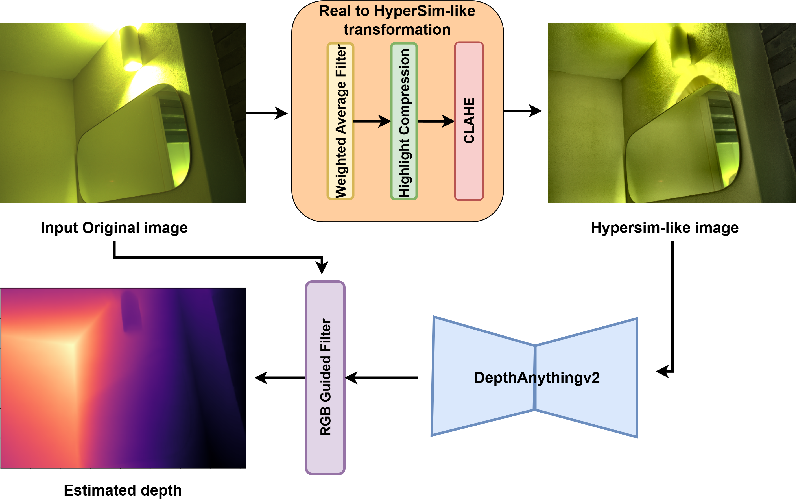
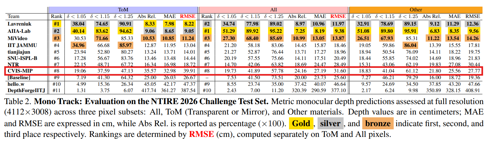

# Hypersimify_DA2



Implementation of Hypersimify DepthAnythingv2 for High-Resolution Depth Estimation of non-Lambertian Surfaces. A simple training-free domain adaptation method for depth estimation of transparent and mirror objects in indoor scenes.

#### News: Our team (CVIS-MIP) is the 8th best runner in NTIRE 2026 Challenge on High-Resolution Depth of non-Lambertian Surfaces. Read the full competition paper [here](https://openaccess.thecvf.com/content/CVPR2026W/NTIRE/html/Ramirez_NTIRE_2026_Challenge_on_High-Resolution_Depth_of_non-Lambertian_Surfaces_CVPRW_2026_paper.html)

We propose Hypersimify-DA2, an efficient method for high-resolution monocular metric depth estimation from images of specular and transparent surfaces. We simply map the input image distribution to the synthetic image distribution to match the Hypersim dataset domain. We use the pretrained DepthAnythingv2 (DA2), which is fine-tuned on the Hypersim dataset for metric indoor depth estimation. This DA2 model is pretrained to accurately estimate the depth of transparent and specular objects, since the dataset is synthetic and provides perfect ground truth for these objects.

The key novelty of our method is implementing a training-free mapping of the input real image domain to the synthetic image domain (HyperSim-like) using a simple Image processing-based pipeline proven to be good enough to map the image domain. 



Our implemetation is based on Metric DepthAnythingV2 [repo](https://github.com/DepthAnything/Depth-Anything-V2/tree/main/metric_depth). You need tp download the Vitl-Hypersim-indoor [weight](https://huggingface.co/depth-anything/Depth-Anything-V2-Metric-Hypersim-Large/resolve/main/depth_anything_v2_metric_hypersim_vitl.pth?download=true) to run Hypersimify-DA2.

To run this code, you need to install the requirements using pip install -r requirements.txt, then you can run the test script as below:

```python hypersimify_test.py --img_path path/to/img.png --checkpoint_path path/to/depth_anything_v2_metric_hypersim_vitl.pth --device cuda```


